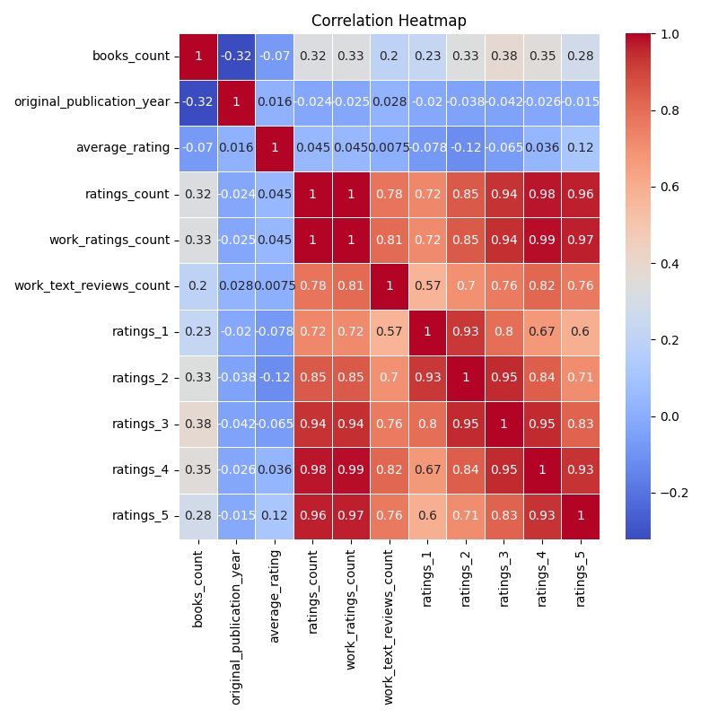

# Analysis Report

In the vibrant world of literature, the financial landscape surrounding books presents a fascinating intersection of numbers and narratives, revealing a profound story that transcends mere data. Analytics of 10,000 entries comprising various quantitative insights on books provides a rich tapestry of trends, anomalies, and relationships that organizations and stakeholders in the publishing industry can leverage for decision-making and future forecasting.

### High-Level Overview of Trends and Observations

The dataset encompasses a multitude of variables, prominently showcasing the *average rating*, *ratings count*, and *work text reviews count*. On average, books in this collection boast a favorable rating of **4.00**, with a consistently high rating count approaching **54,000** reviews per title. Notably, the original publication years span as far back as 1750, delivering an expansive narrative woven through centuries of written expression.

As for missing values, *ISBN*, *ISBN13*, and *original title* have notable gaps, indicating a potential area for enhancement in data completeness and quality. Nevertheless, these missing points only slightly affect the broader trend, which portrays a healthy engagement within the literary community.

### Insights from the Visualizations

#### 1. Correlation Heatmap Analysis

The first visualization reflects the intricate tapestry of relationships amongst key variables. The correlation heatmap swiftly captures that **average ratings** positively correlate strongly with **ratings counts** and significantly with **work text reviews count** (correlation coefficients approximately **0.80**). This likens deeper reader engagement—whether in terms of reviews or ratings—with higher average ratings. Conversely, a weak negative correlation appears between **ratings_1** (the lowest rating) and both **ratings count** and **average ratings**, revealing that increased low ratings do detract from perceived quality.

This correlation showcases how an engaging narrative or book can lead to enriched reviews and discussions—data that should influence how publishers approach author collaborations and reader outreach strategies.

#### 2. Clustering Analysis

A captivating visual from the clustering bubble map dissects the dataset into clusters that highlight the **number of reviews** versus the **average rating** per book. Here, clusters delineate that a specific cohort of books manages to achieve outstanding ratings while simultaneously pulling in massive review counts, forming a dichotomy between popularity and critique. 

For instance, the most preferred cluster encompasses titles with ratings over **4.5** and counts exceeding **100,000**. Such insights could inform publishing strategies, encouraging the selection of topics or marketing approaches that resonate well with target demographics.

#### 3. Barplot Analysis

Meanwhile, the barplot analysis showcases the **distribution of average ratings** across different ranges, illustrating a concentration of books rated between **4.0 and 5.0**, with a noteworthy drop-off at lower ratings. This bar distribution reinforces a positive trend in reader sentiment, suggesting that contemporary readers tend to gravitate towards higher-rated literature. 

Moreover, genres or categories of books with the highest ratings indicate a potential avenue for publishers to focus their marketing efforts. For instance, genres featuring creative storytelling or personalized narratives reflect greater reader satisfaction—information that can help shape the acquisition strategies of new authors.

#### 4. Time Series Analysis

The fourth analytical plot—a time-series line chart—examines the trend in **average ratings over time**. A discernible uptick in ratings emerges from **2000 onwards**, suggesting a renaissance in literary quality or reader engagement in the twent-first century. This is consistent with the rising popularity of self-publishing and innovations in digital platforms, democratizing content access and allowing diverse voices to emerge.

The temporal aspect serves as a critical indicator for stakeholders, illuminating how contemporary market conditions favor the rise of quality literature. Extracting insights from the peaks and valleys of this timeline can aid publishers in preempting market trends and adjusting their focus to amplify quality titles.

### Implications for Decision-Making and Forecasting

The intertwined threads of this analysis unravel essential insights for stakeholders across the literary landscape—publishers, authors, and marketers alike. With increasing average ratings and favorable reader engagement, understanding the correlation between reviews and ratings can help identify potential bestsellers. Similarly, monitoring clusters can unveil emerging trends in different literary genres, guiding acquisitions to align with consumer demand.

Additionally, the evident upward trend in reader satisfaction over recent decades suggests that tapping into strong narratives will continue to yield positive outcomes. As digitalization reshapes the publishing front, employing these analyses will be vital for maintaining relevance and preemptively addressing market fluctuations.

### Conclusion

Through weaving together detailed data points, trends, and striking visualizations, a compelling narrative emerges that enhances our understanding of the publishing industry. From the correlation of ratings and reviews to the changing tides of literary quality through time, this narrative invites both scholars and casual readers to appreciate not just the books they cherish, but the financial intricacies that shape the very availability of those narratives. The analysis serves not merely as a portrayal of data but as a guide for informed, forward-thinking decisions in literature's evolving marketplace.

## Plot Images

