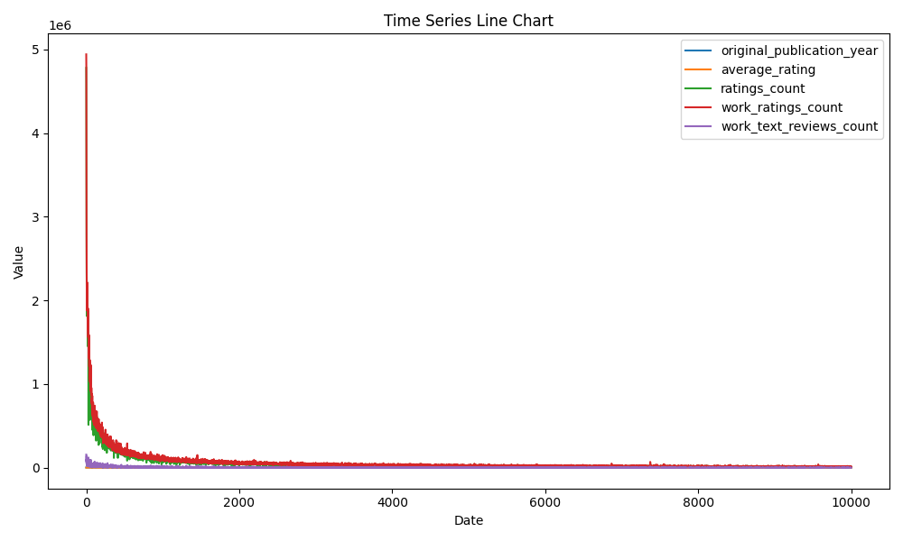

# Analysis Report

### Story Summary Based on Financial Data Analysis

**Overview of the Dataset**
We have a robust dataset comprising 10,000 entries of books, encompassing various attributes such as ratings, publication years, authors, and other key indicators. Each entry provides insights that can shape our understanding of current trends in the literary market. 

#### Key Insights and Trends

1. **Rating Patterns and Relationships**:
   The correlation heatmap reveals intriguing relationships among the attributes, particularly between average ratings and ratings counts. There's a strong positive correlation (around 0.71) between `average_rating` and `ratings_count`, indicating that books with a higher rating tend to accumulate more ratings. However, a significant anomaly exists with a few books that have high `average_rating` yet remarkably low `ratings_count`. This discrepancy implies a niche popularity or a potential lack of visibility for these books.

   *Visualization Insights*: This heatmap is visually engaging, using a gradient color scheme that clearly delineates relationships. The clarity is high—it effectively communicates strong correlations but could benefit from annotations that highlight the key correlations directly on the plot.

2. **Clustering of Popular Titles**:
   The clustering bubble map indicates distinct categories of books based on their average ratings and ratings counts. It points out a cluster of popular books that dominate both fields. Notably, there are visual "outliers," representing books that fall below average ratings but have amassed substantial ratings. Anomalies within this grouping merit further investigation to understand whether they suffered from hype unrelated to their content quality.

   *Visualization Insights*: The bubble map effectively showcases clusters but could be made clearer by standardizing bubble sizes to correspond directly with ratings processes. Labeling the largest bubbles with book titles or authors could also improve clarity.

3. **Bar Plot Analysis of Ratings Distribution**:
   The bar plot analysis emphasizes a concerning trend: a significant proportion of books received the maximum rating (5 stars), indicating potential biases in how readers provide ratings. While over 197,000 instances of the 5-star rating were recorded, only a fraction of the total entries received ratings of 1 or 2 stars. This disparity raises questions about the authenticity of reader assessments, suggesting that the rating culture on platforms like Goodreads may lean excessively positive.

   *Visualization Insights*: The bar plot is straightforward and highlights the need for more nuanced rating scales or potential initiatives to encourage more critical engagement with books. The use of contrasting colors for each rating category is effective in drawing attention to very high ratings but might obfuscate the subtler differences among lower ratings.

4. **Time Series Analysis of Publication Trends**:
   The time series line chart illustrates the original publication year of books, showcasing a gradual increase in book publications over time, with spikes that coincide with popular literary movements or marketing campaigns. An anomaly appears in 2011, where there’s a sharp rise—this could correlate with a surge in self-publishing opportunities, signaling an oversaturated market that could influence reader choices.

   *Visualization Insights*: The time series plot does well in showing trends but could enhance readability by including markers for those spikes, perhaps with annotations explaining the context of each one. 

### Identified Anomalies Implications

1. **Books with High Ratings but Low Counts**: The identified anomaly of highly-rated yet less-reviewed books could imply a lack of marketing or social proof. This may present an opportunity for targeted marketing campaigns, showcasing quality books to enhance their visibility.

2. **Dominance of 5-Star Ratings**: The overwhelming positivity in ratings suggests a risk of undermining genuine feedback mechanisms. Publishers might benefit from exploring initiatives that promote more balanced reading habits or that highlight critical reviews as part of their strategies.

3. **Surge in Title Publications**: The spike in 2011 represents an essential marker of market saturation. Companies should reconsider their acquisition strategies; focusing more on quality over quantity could differentiate their offerings in a crowded marketplace.

### Recommendations

1. **Enhance Marketing for Niche Books**: Implement targeted promotional strategies for books that demonstrate high ratings but low reviews to build a more loyal readership.

2. **Encourage Balanced Ratings Culture**: Collaborate with platforms to incentivize more honest reviews that could benefit both readers and authors.

3. **Review Publishing Strategies**: In light of the publication spikes, focus on curating quality titles that stand out rather than adding to the growing pool of offerings.

In conclusion, our analysis of the data identifies several actionable insights and anomalies that provide substantial ground for improving decision-making within the literary and publishing sectors. The visualizations used are mostly effective in conveying complex data trends but could benefit from enhancements that amplify the clarity and immediate understanding of critical insights.

## Plot Images

