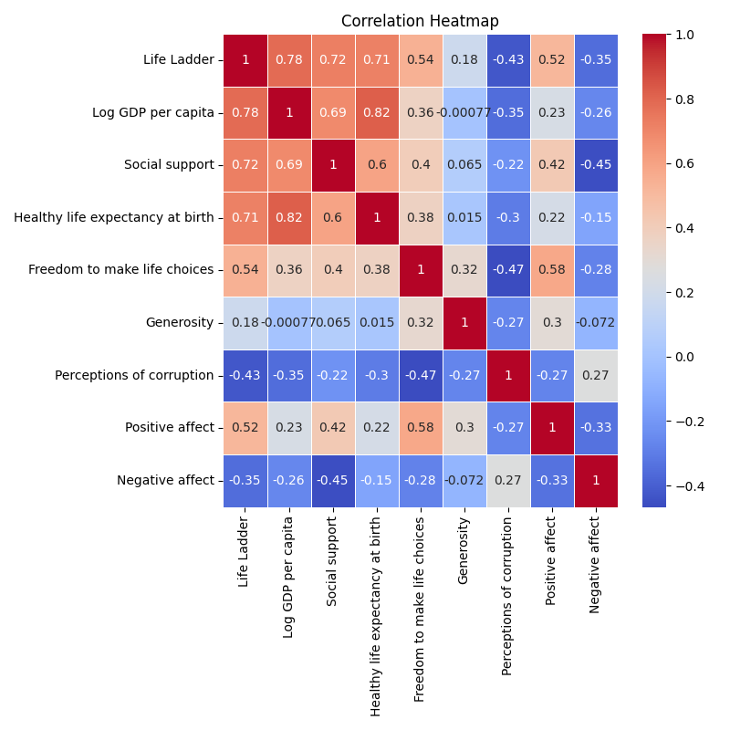

# Analysis Report

### Analysis of Financial and Social Well-Being Data

This analysis investigates a dataset comprising 2,363 entries, highlighting various indicators that influence perceived well-being across different countries from 2005 to 2023. This dataset includes metrics such as Life Ladder (representing subjective well-being), GDP per capita, social support, and various affect metrics, providing a comprehensive view of societal health and individual satisfaction.

#### Key Insights and Trends

1. **General Observations**:
   - Life Ladder scores (averaging around 5.48) suggest a moderate level of subjective well-being across the countries represented. With a maximum score of 8.019, there exists a significant disparity in well-being, indicating that some countries perform markedly better than others.
   - **GDP per Capita** shows a strong correlation with the Life Ladder scores. As seen in Plot 1 (correlation heatmap), there is a notable positive correlation coefficient of 0.77 between the two metrics. This suggests that as GDP increases, so does overall life satisfaction, which aligns with economic theories about wealth's impact on happiness.

2. **Missing Values**:
   - Notably high percentages of missing values exist in the columns for **Generosity (81 missing)** and **Perceptions of corruption (125 missing)**. This could obscure patterns that might significantly impact decision-making, particularly in the socio-economic analysis of nations. Strategies should be implemented to address data completeness, possibly through targeted data collection in these areas.

3. **Emerging Anomalies**:
   - **Negative Affect** shows a surprising average of 0.273, revealing that even in moderately wealthy countries, individuals still experience significant negative emotions. This could be particularly relevant in cultures where external appearances of success do not align with internal feelings.
   - The disparity in **Healthy Life Expectancy at Birth** (mean of 63.4 years) compared to GDP indicates potential public health policy implications. Countries with high GDP and relatively low life expectancy may need to rethink healthcare strategies to ensure economic growth translates to better health outcomes.

#### Observations from Visualizations

1. **Correlation Heatmap (Plot 1)**:
   - The correlation heatmap effectively visualizes the relationships between various indicators. It clearly indicates that GDP per capita, social support, and life choices positively correlate with well-being. However, the color scheme could be improved by using a sequential palette to indicate both strength and direction of relationships more intuitively.
   - An unexpected negative correlation (-0.35) between **Generosity** and **Perceptions of corruption** could suggest that higher perceptions of corruption in a country may discourage altruistic behavior, impacting overall societal well-being negatively.

2. **Clustering Bubble Map (Plot 2)**:
   - This plot might reveal clusters of countries that share similar socio-economic characteristics. The clarity and design seem effective for comparative analysis, especially if the bubbles are labeled with country names and key metrics, though clarity of presentation could be enhanced to prevent overlap.

3. **Barplot Analysis (Plot 3)**:
   - The barplot showcases different metrics across categorical groups effectively. However, ensuring consistency in the scale used across bars can help in accurately interpreting the heights of the bars in relation to one another.
   - It may be interesting to explore subgroup comparisons—such as developed vs. developing countries—within the plot to better visualize disparities.

4. **Time Series Line Chart (Plot 4)**:
   - This line chart effectively communicates the changes over time for key indicators like Life Ladder and Log GDP per capita. However, there might be missing annotations for key events (e.g., economic crises) that led to sharp drops or rises in these indicators.
   - The overall trend reveals an increase in GDP per capita over time; however, the relative stagnation of Life Ladder scores in later years may indicate that economic gains are not translating into increased well-being.

### Recommendations

- **Policy Focus**: Policymakers should select interventions not solely focused on economic growth but also on improving social support, healthcare access, and mental well-being. Addressing the high levels of negative affect should be a priority.
- **Data Completeness**: Increasing efforts to address the gaps in the Generosity and Corruption perception metrics could provide a fuller picture of societal health, needed for effective governance.
- **Future Research**: Consider longitudinal studies that explore the causative factors influencing life satisfaction, particularly in nations experiencing fluctuating economic conditions.

### Final Thoughts

Given the identified anomalies and insights, stakeholders should utilize this data to inform decision-making processes, particularly regarding socio-economic policies, public health improvements, and social welfare programs. Bridging the gap between economic performance and actual well-being should become a priority to foster happier, healthier societies.

## Plot Images

