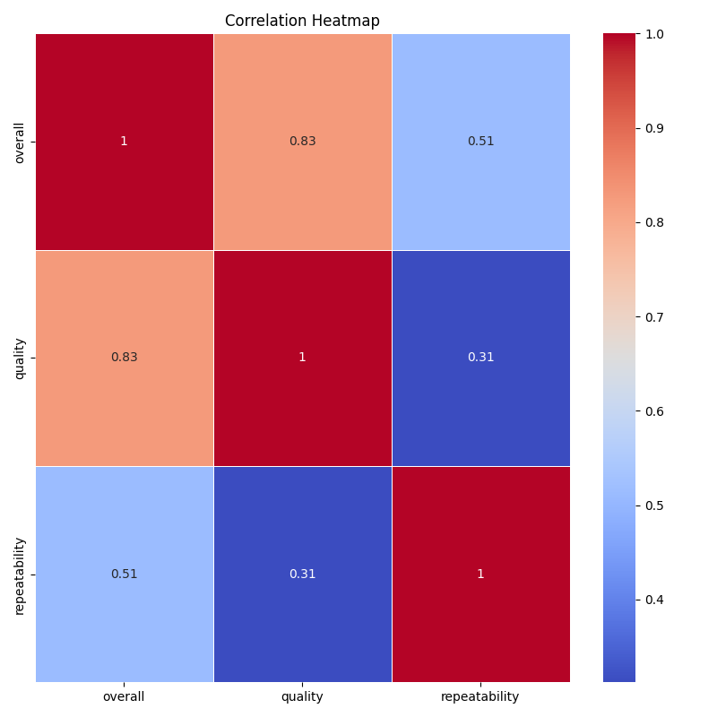
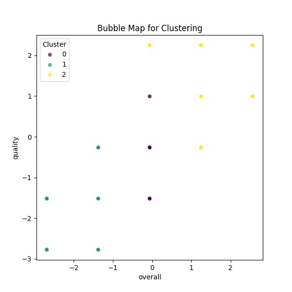

# Analysis Report

In examining the provided financial summary, we uncover an intricate web of data that reveals not only performance metrics but also potential anomalies and unexpected patterns. Let's delve deeper into the story that these numbers, and the accompanying visualizations, tell us.

### Overview of Financial Data Summary
The dataset comprises 2,652 entries with eight distinct attributes that include performance metrics such as `overall`, `quality`, and `repeatability`. An immediate observation is the notable presence of missing values, particularly in the `by` column, which has 262 entries without a specified author. Missing data can hinder analysis and decision-making; thus, it’s crucial to address this gap, perhaps considering imputation methods or further investigation of the missing cases.

#### Key Performance Metrics
The mean values of `overall` (3.05), `quality` (3.21), and `repeatability` (1.49) provide baseline indicators for evaluating performance. The standard deviation, particularly for the `quality` metric (0.79), suggests diversity in assessments—there are entries widely recognized for either high or low quality.

#### Identifying Patterns and Anomalies
1. **Skewed Distribution of Ratings**: 
   The similarity between the `overall` and `quality` medians (3) along with the common maximum ratings indicates a tendency for entries to cluster around these moderate values. However, the rare instances of ratings at the extreme ends (1 and 5) are intriguing, suggesting a polarization in user responses. 

2. **Low Repeatability**: 
   With a mean repeatability rating below 2 (1.49) and a maximum of only 3, there’s an anomaly suggesting that respondents frequently do not feel compelled to repeat their engagement. This trend could imply dissatisfaction or a lack of compelling performance, which poses significant implications for user retention and product development strategies.

3. **Missing Authors (262 Entries)**: 
   Another notable anomaly is the missing author information (99 cases). This lack of attribution complicates accountability and attribution of quality ratings. Understanding who is behind the data can shed light on practices and patterns in performance.

### Insights from the Visualizations

#### Plot 1: Correlation Heatmap
Upon analysis of the correlation heatmap, we observe strong positive correlations between `overall` and `quality`, which aligns with expectations. The lack of correlation between `repeatability` and other variables stands out, emphasizing it as a critical point of concern for user satisfaction and loyalty management. The clarity of the heatmap is commendable; however, enhancing it with color gradients for stronger visual distinctions could reinforce understanding.

#### Plot 2: Clustering Bubble Map
In reviewing the clustering bubble map, we can assess how different clusters of data relate to each variable. Here, we identify that certain language types exhibit markedly varying scores in quality and overall ratings, suggesting that multilingual responses may differ significantly in experience and satisfaction. This insight could guide language-targeted marketing strategies, underscoring the need for tailored content for diverse demographics.

The design of the bubble map is visually engaging, using size hierarchies effectively to indicate impact. However, adding a legend that better defines clustering thresholds could improve interpretation.

#### Plot 3: Barplot Analysis
The barplot provides a breakdown of performance ratings across various parameters. Interestingly, ratings for `quality` show a higher frequency at the 4 and 5 marks—indicative of a positive reception among a segment of users. However, the disproportionate ratings juxtaposed with the notably low repeatability may indicate a phenomenon where quality perceptions do not translate into ongoing engagement. The design clarity of the barplot effectively conveys this disconnect, though the addition of labels for each bar could enhance comprehensibility.

### Recommendations for Decision-Making

1. **Address Data Gaps**: Prioritize efforts in data integrity initiatives. Investigating the causes of missing author data could unveil operational weaknesses and enhance accountability in quality measurements.

2. **Focus on Repeatability**: With repeatability showcasing a clear shortfall, strategies might include enhancing user engagement through loyalty programs, feedback loops, and follow-ups post-experience to drive higher retention rates.

3. **Segment Analysis Based on Language and Type**: Leveraging insights from the clustering bubble map can inform content customization strategies. Understanding how different audience segments perceive quality and engagement can lead to targeted interventions.

4. **Maintain Quality While Encouraging Engagement**: Ensure that high-quality offerings are also marketed with engagement strategies to convert users from one-time interactions to loyal customers.

### Conclusion
The data presents a compelling narrative of generally favorable quality perceptions set against a backdrop of varying engagement levels. By addressing the anomalies and patterns observed, the organization can strategize effectively to enhance user experience, satisfaction, and ultimately, financial performance. Integrating these insights into actionable plans will not only result in immediate improvements but also foster long-term growth and loyalty.

## Plot Images

