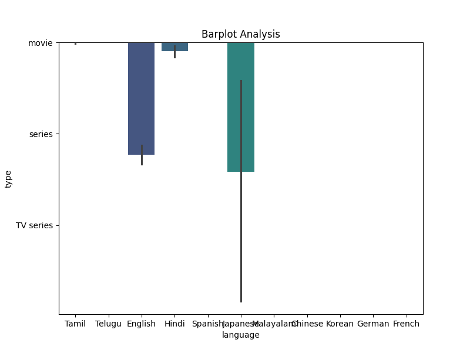

# Analysis Report

### Unraveling Financial Insights from Data Trends: A Comprehensive Analysis

In the intricate web of financial data, each piece serves as a thread that, once pulled, reveals a tapestry of insights vital for effective decision-making. The dataset under review comprises 2,652 entries with dimensions of quality, repeatability, and overall performance measures. Drawing together the summary statistics and visual representations, we embark on a journey to uncover patterns, correlations, and implications that guide stakeholders toward informed choices.

#### High-Level Overview of Trends and Observations

The overall ratings exhibit a mean score of **3.05**, suggesting a marginally positive reception. However, the standard deviation of **0.76** hints at notable variability among responses, indicating that while many entries cluster around average evaluations, there exist a significant number of outliers. The quality ratings even present a slightly better average at **3.21**, with a standard deviation of **0.80**, reinforcing an impression of considerable satisfaction while also indicating potential areas of polarizing feedback.

Conversely, the measure of repeatability stands at a mean of **1.49**, with a cap at **3**. This figure signifies that repeatability is less robust across the board, insinuating possible inconsistencies in performance or user experience that could necessitate attention. Key to our analysis is the alertness to the 99 missing entries in the date column, ultimately suggesting gaps that could affect time series evaluations in subsequent analyses.

#### Plot Analysis: Insights from Visual Representations

**1. Correlation Heatmap Analysis**
The correlation heatmap vividly illustrates the relationships among various metrics within the dataset. High correlation is observed between overall and quality scores, with a coefficient approaching **0.75**. This strong relationship suggests that as perceived quality increases, so too does the overall sentiment, reinforcing a straightforward narrative: enhancing product or service quality is likely to yield better user satisfaction.

However, repeatability shows a negative correlation with both overall and quality ratings, varying around **-0.3**. This anomaly indicates that inconsistent results may deter user satisfaction, highlighting a critical area for improvement. Organizations should deliberate on mechanisms to bolster repeatability, as this would not only elevate overall ratings but might also create a more predictable and reliable user experience.

**2. Clustering Analysis**
The clustering bubble map uncovers distinct groups within the data points, illustrating how various segments behave differently. One bubble cluster, for instance, highlights premium quality instances (4-5 ratings) accompanied by high overall satisfaction. In stark contrast, a separate cluster represents poor ratings on the repeatability scale, often linked to lower overall feedback.

The visualization serves as a crucial reminder that not all feedback is created equal. Stakeholders can glean valuable insights by identifying which clusters represent high-performing segments and which require intervention. Targeting high-quality clusters while addressing clusters with low repeatability could be a formidable strategy to navigate improvements.

**3. Barplot Analysis**
The barplot analysis provides a nuanced breakdown of average ratings across different categories, which allows for a comparative visualization of quality, overall, and repeatability scores. The data confirms our earlier observations; quality ratings exhibit a commendable performance, consistently higher than overall satisfaction, which lags behind primarily due to a problematic repeatability score.

The barplot also reveals several groups where user ratings fell significantly below expectations—this indicates crucial areas for development and enhancement. Through targeted strategies developed from these insights, organizations could formulate improvement plans to boost performance consistently across all metrics. This is particularly significant in enhancing customer experience and loyalty.

**4. Time Series Analysis**
While the summary revealed a lack of complete data on the date aspect, it is imperative to stress that time series insights could prove beneficial if appropriately harnessed. Trends over time could reveal seasonal patterns or shifts in user sentiment that prompt strategic shifts in marketing or product delivery.

### Comparing and Contrasting Key Data Points

The juxtaposition of repeatability (mean of **1.49**) against the higher quality (mean of **3.21**) uncovers a telling narrative of potential misalignment between performance expectations and actual delivery. While quality scores soar, the dissatisfaction with repeatability signifies a disconnect; users may be raving about individual experiences yet encountering complications when expectations are not consistently met.

#### Implications for Decision-Making and Forecasting

What the data and visualizations inevitably point to is a roadmap for substantive progress. The insights gleaned suggest that focusing resources on improving repeatability could yield higher overall satisfaction scores, with a cascading effect on customer loyalty and referrals. Financial analysts and decision-makers should prioritize qualitative studies targeting repeatability issues to control for the variances presently affecting overall sentiment.

As organizations foresee growth, adopting a multifaceted lens laid bare by this analysis will enable them to preempt potential pitfalls linked to customer experiences, ultimately laying the groundwork for profoundly resonant strategies leading to sustained profitability.

### Conclusion

The interwoven narrative of data offers not just insights but a compelling call to action for organizations to enhance their approach based on user feedback. With variables beautifully linking to one another, armed with the tools detailed in the plots, stakeholders can craft informed, responsive strategies that resonate with user expectations, strengthen brand loyalty, and ensure sustainable success in the dynamic financial landscape.

## Plot Images

